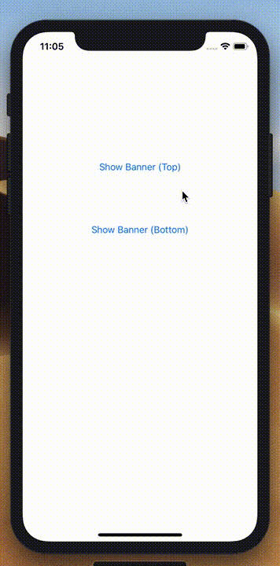

# Titanium Notification Banner

A lightweight notification banner for Titanium.



## Requirements

- [x] ES6+ enabled in the tiapp.xml (`<transpile>true</transpile>`)

## Known Issues

- If the notification banner is shown on a nodge-based device (e.g. iPhone X) and the container is not the window (e.g. a tab-group or navigation-window), the safe area insets should not be applied

## Example

```js
import { 
  NotificationBanner, 
  NotificationBannerType, 
  NotificationBannerPosition 
} from 'titanium-notification-banner';

new NotificationBanner({
  title: 'Titanium rocks!',
  view: yourParentView,
  type: NotificationBannerType.INFO,
  position: NotificationBannerPosition.BOTTOM
}).flash();
```

## Methods

- `show(options)`
  - `options`: `dismissAfterDelay` (milliseconds)
- `hide()`
- `flash()`

## Properties

- `title` (Required)
- `view` (Required)
- `type` (`NotificationBannerType`, one of `INFO`, `SUCCESS`, `WARN`, `DANGER` or `NONE`)
- `position` (`NotificationBannerPosition`, one of `BOTTOM` or `TOP`)

## License 

MIT

## Author

Hans Knöchel, Lambus GmbH
